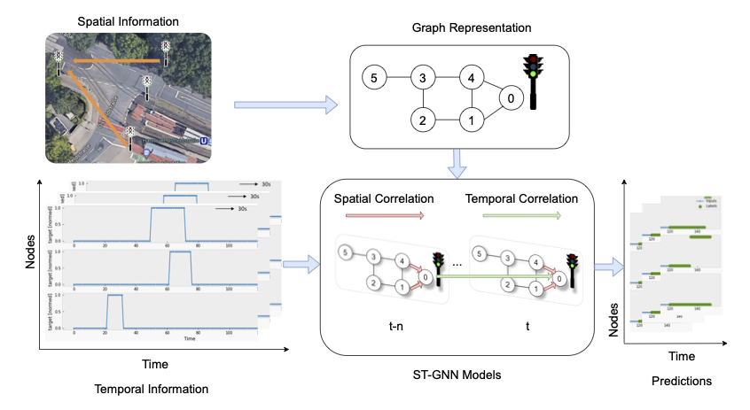

# LOGIN-Optimally controlled traffic light systems in local transport
Machine learning models developed with Tensorflow to forecast time series (traffic-actuated lights)
Temporal models:
* Baseline
* CNN
* Linear Model
* Dense Model
* LSTM
* AR LSTM
  
Spatio-temporal models (Keras based):
* Homogeneous GCN-LSTM
* Homogeneous GCN-AR LSTM
* Heterogeneous GCN-LSTM
* Heterogeneous GCN-AR LSTM

Pipeline to build spatio-temporal models:

**Table: AUCs of all temporal and spatio-temporal models at different forecasting horizons**

| Features                          | Models        | AUC (1 s) | AUC (15 s) | AUC (30 s) |
|----------------------------------|---------------|-----------|------------|------------|
| Temporal                         | LSTM          | **0.9999**| 0.9382     | 0.7608     |
| Temporal                         | AR LSTM       | **0.9999**| 0.9610     | 0.8681     |
| Homogeneous spatio-temporal      | GCN-LSTM      | 0.9837    | 0.9047     | 0.8423     |
| Homogeneous spatio-temporal      | GCN-AR LSTM   | 0.9828    | 0.9043     | 0.8005     |
| Heterogeneous spatio-temporal    | GCN-LSTM      | 0.9852    | 0.9472     | 0.8543     |
| Heterogeneous spatio-temporal    | GCN-AR LSTM   | 0.9948    | **0.9767** | **0.8785** |

For the medium and long forecasting horizons, the heterogeneous GCN-AR LSTM outperforms other models. It is proven that the introduction of spatial dependencies has a positive influence on the improvement of forecasting ability, but it depends on the forecasting horizon. It seems that for really short predictions, temporal features play a more important role, while for longer predictions, spatial dependencies could be viewed as an improvement. 

The proposed signal prediction framework can be integrated into vehicle–infrastructure cooperation systems to support cooperative speed guidance and intersection management. In addition, they could be adapted for other tasks, such as traffic flow prediction and arrival time prediction.
